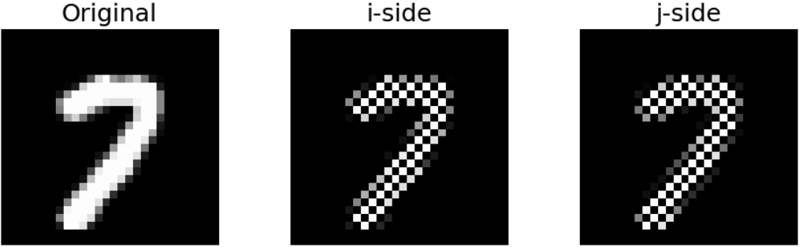
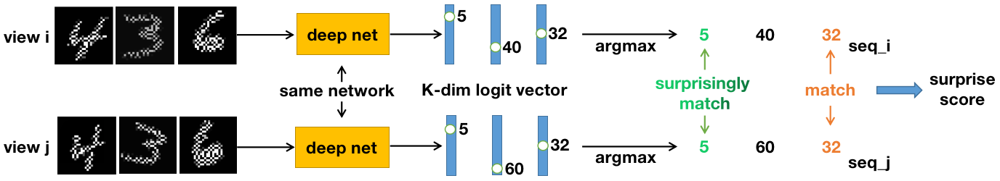
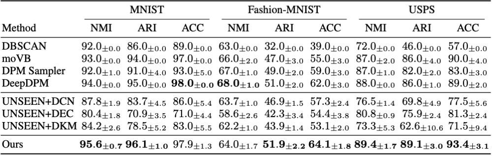
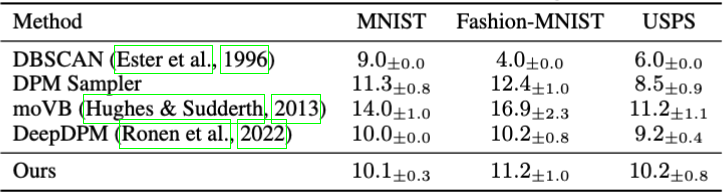
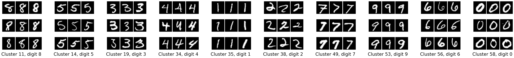
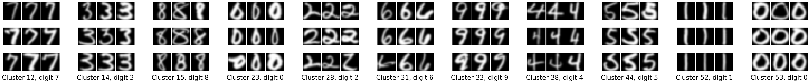
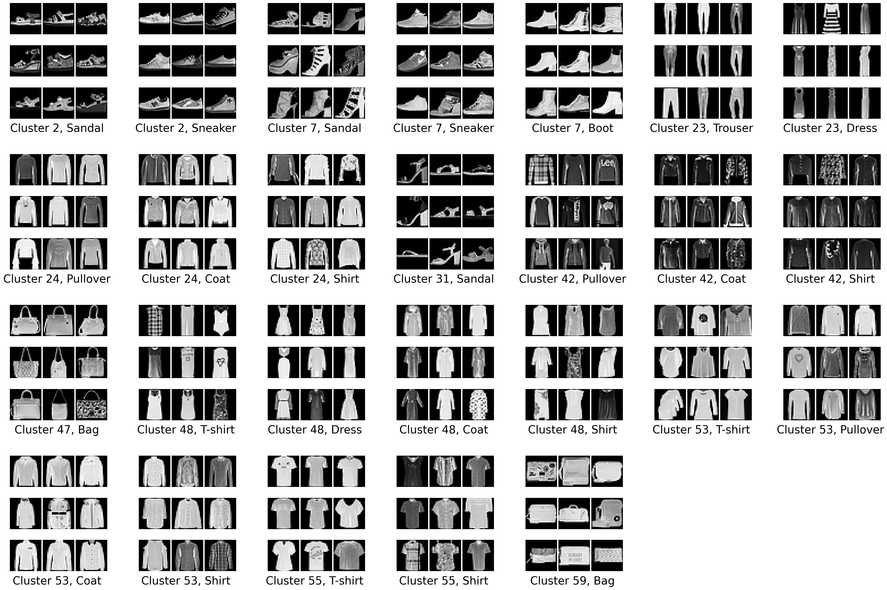

# Converge to Surprise

Official code for **"Converge to Surprise: Evolutionary Self-supervised Image Clustering"**
(Canlin Zhang, Xiuwen Liu). Paper: https://arxiv.org/abs/2607.06887

Fully **unsupervised, non-parametric image clustering** (MNIST, FashionMNIST, USPS) — the strictest deep-clustering setting, where the number of
classes *K* is **not** given to the optimizer. A deep network is trained **without
labels** by maximizing a statistical **Surprise Score** with a **gradient-free
Evolution Strategy (ES)**, plus periodic **gradient-based fine-tuning on surrogate
labels** to consolidate clusters. Everything is learned from **raw pixels** — no
pretrained features.

## Idea in one paragraph

Under the Principle of Maximum Entropy, the most conservative null hypothesis
`H0` is that images are i.i.d. pixel noise. Two complementary **chessboard
half-views** of an image share zero mutual information under `H0`. The **Surprise
Score** `S(θ)` measures how strongly the network's two-view argmax assignments
*violate* that independence — i.e. how much non-random structure it found. `S(θ)`
reads `argmax` indices over a dynamically-changing set of over-matching clusters,
and we hypothesize that a surprise score cannot, in general, be fully optimized by
exploitative approaches, whose parameter updates are determined by the current
samples and parameters. We therefore maximize it with an explorative **ES outer loop**
(mutation-selection, the long-term *explorer*) and a periodic **surrogate
fine-tuning inner loop** (the short-term *consolidator*).

## Complementary (chessboard) masking

We partition an image's pixel grid with a chessboard pattern into two disjoint sets
and build two complementary views: the *i*-side keeps only the pixels at the white
chessboard positions (and zeros out the rest), while the *j*-side keeps only those at
the black positions. Every pixel appears in exactly one view, so the two views share
no pixel in common. Under the i.i.d.-noise null hypothesis `H0`, they are therefore
independent and carry zero mutual information — the property the surprise score is
designed to violate.

<p align="center">
  
</p>

## Pipeline

Each image is split into two complementary chessboard-masked views, augmented
independently (**random rotation, random cropping and brightness/contrast jittering, plus a horizontal flip on FashionMNIST only and an anisotropic zoom-out on USPS only. Refer to Section 4.1 and Appendix F of our paper for more details**), and passed through the **same** network, which outputs a
*K*-dimensional logit vector per view. Taking the `argmax` of each vector yields two
cluster-index sequences; whenever both views of an image land in the same cluster
(a *view match*), the co-occurrence count of that cluster grows. The surprise score
sums, over the over-matching clusters, how strongly these co-occurrences violate the
i.i.d.-noise null hypothesis `H0`.



## State-of-the-art results

Our method achieves **state-of-the-art non-parametric clustering** on MNIST,
Fashion-MNIST, and USPS — leading on USPS across all three metrics (NMI/ARI/ACC),
leading on NMI and ARI while matching the strongest baseline on ACC on MNIST, and
obtaining the best ACC and ARI on Fashion-MNIST — **directly from raw pixels**,
without pretrained features and without being given the number of classes. It also
recovers a number of active clusters close to the ground truth.



*Main results (%, mean ± std over 10 runs): NMI / ARI / ACC on MNIST, Fashion-MNIST,
and USPS versus the leading non-parametric methods — DeepDPM, the UNSEEN variants,
and classical DPM clusterers. Higher is better; best per column in bold. Unlike the
baselines, our method clusters directly from raw pixels.*

<p align="center">
  
</p>

*Inferred number of active clusters (mean ± std); the ground-truth value is 10. Our
method self-regulates near the true class count without ever being told it.*

## Clustering results

Test-set clusters discovered from raw pixels (no labels, no pretrained features).
Each panel is a 3×3 grid of random test images sharing a predicted cluster and a
ground-truth class (only classes contributing ≥ 50 images to a cluster are shown);
captions read `Cluster k, <class>`.

**MNIST** — the ten active clusters map one-to-one to the ten digits (97–99.7% purity):



**USPS** — a run that discovered 11 clusters; clusters 23 and 53 both capture the
digit 0 (round/plain vs. narrow/tall), the residual over-split of the dominant class:



**FashionMNIST** — the hardest case; beyond coarse categories the network separates
finer attributes, e.g. bags with vs. without a handle, and garments by texture
(patterned vs. plain) rather than contour:



## Repository structure

```
main.py                              # training entry point (ES per epoch + staged fine-tuning)
test.py                              # evaluation: DeepDPM square-Hungarian ACC + NMI/ARI + purity report
scripts/
  deep_network.py                    # ResNet-9 backbone (B,C,H,W) -> (B,K) logits
  pair_maker.py                      # chessboard two-view masking + per-dataset augmentation
  surprise_score.py                  # the training signal (per-dim binary-KL surprise)
  evolution_strategy.py              # parallel ES (torch.vmap), mirrored sampling, centered-rank update
  train_and_eval_one_epoch.py        # 3-phase surrogate fine-tuning
  utils.py                           # DeepDPM square-Hungarian cluster_acc helper
  pair_maker_CIFAR10.py              # pair_maker.py + the CIFAR-10 pipeline (greyscale + Sobel views)

# Supplementary: CIFAR-10 and the differentiable baselines (see below)
main_CIFAR10.py                      # main.py, using pair_maker_CIFAR10.py
main_softmax.py                      # baseline: plain-softmax surprise score, trained end to end by Adam
main_softmax_2.py                    # baseline: Gumbel-softmax surprise score, trained end to end by Adam
test_other.py                        # test.py, using pair_maker_CIFAR10.py: evaluates every supplementary run
```

## Setup

```bash
pip install -r requirements.txt
```
Requires Python 3.9+ and a CUDA-capable GPU (training is impractically slow on CPU;
CPU evaluation works with `CUDA_VISIBLE_DEVICES=""`). The MNIST / FashionMNIST / USPS (and
CIFAR-10) datasets are **downloaded automatically** by `torchvision` into `./data/` on first
run (this folder is git-ignored).

## Training

Each command runs `--number_of_experiments` (default **10**) independent experiments
into `<save_dir>0/ … 9/`. Pick a GPU with enough free memory (~30 GB at the default
`base_width=8`, `population_size=32`).

```bash
# MNIST — 2-stage schedule (pure ES until epoch 2000, then ES with fine-tuning every 25 epochs until 3000)
CUDA_VISIBLE_DEVICES=0 python main.py \
    --save_dir ./model_bin/mnist_run/ --dataset_name MNIST \
    --train_start_epoch_1 2000 --train_start_epoch_2 2000 --num_epochs 3001

# FashionMNIST — same 2-stage schedule
CUDA_VISIBLE_DEVICES=0 python main.py \
    --save_dir ./model_bin/fmnist_run/ --dataset_name FashionMNIST \
    --train_start_epoch_1 2000 --train_start_epoch_2 2000 --num_epochs 3001

# USPS — 3-stage schedule, larger batch, longer training (fewer images)
CUDA_VISIBLE_DEVICES=0 python main.py \
    --save_dir ./model_bin/usps_run/ --dataset_name USPS \
    --train_start_epoch_1 4000 --train_start_epoch_2 8000 --num_epochs 9001 --N 3650
```

Checkpoints are written per experiment: `optimal_autoencoder.pth` (rewritten every
epoch) and frozen `optimal_autoencoder_epoch_<n>.pth` every 1000 epochs. `test.py`
evaluates `optimal_autoencoder.pth`, the final model.

## Evaluation

Evaluate a single finished experiment directory:

```bash
CUDA_VISIBLE_DEVICES=0 python test.py \
    --save_dir ./model_bin/mnist_run/0/ --dataset_name MNIST
```

This reports clustering accuracy (DeepDPM square-Hungarian assignment), NMI, ARI,
the number of active clusters, per-class accuracy, and a cluster-purity report.

## Key hyperparameters (defaults)

`--K 64 --N 3000 --base_width 8 --population_size 32 --sigma 0.02
--learning_rate 0.005 --weight_decay 0.005 --num_train_epochs 4 --kl_threshold 0.005
--number_of_experiments 10`. Per-dataset augmentation is configured in
`scripts/pair_maker.py`.

## Supplementary: CIFAR-10 and the differentiable baselines

These scripts reproduce two appendix experiments of the paper: Appendix C
(differentiable relaxations of the surprise score, trained by exploitative
gradient descent) and Appendix I (the CIFAR-10 failure mode). They are **not** used
for the main results above, and they leave `main.py`, `test.py` and the scripts
listed above untouched: they are separate copies that import
`scripts/pair_maker_CIFAR10.py` in place of `scripts/pair_maker.py`. Every model,
CIFAR-10 included, is the same ResNet-9 (`base_width=8`).

**The CIFAR-10 pipeline.** `pair_maker_CIFAR10.py` adds a CIFAR-10 branch adapted
from IIC's preprocessing: chessboard mask on RGB → neighbour smoothing of each
view → augmentation (random crop with edge 20–32 px, horizontal flip,
brightness / contrast / saturation 0.4, hue 0.125; no rotation) → greyscale →
Sobel. Every step after masking acts on each view separately, so the two views
stay independent under `H0`. The network therefore sees **2-channel** (Sobel-x,
Sobel-y) views. On MNIST, FashionMNIST and USPS, `pair_maker_CIFAR10.py` produces
views bit-identical to `pair_maker.py`.

**Train and evaluate on CIFAR-10 with ES + fine-tuning** (2-stage schedule, as for
MNIST):

```bash
CUDA_VISIBLE_DEVICES=0 python main_CIFAR10.py \
    --save_dir ./model_bin/cifar10_run/ --dataset_name CIFAR10 \
    --train_start_epoch_1 2000 --train_start_epoch_2 2000 --num_epochs 3001 --N 3125

CUDA_VISIBLE_DEVICES=0 python test_other.py \
    --save_dir ./model_bin/cifar10_run/0/ --dataset_name CIFAR10
```

`main_CIFAR10.py` runs 5 experiments by default and also
accepts `--init_from <checkpoint>` (start every experiment from given weights, with
the full ES + fine-tuning schedule) and `--resume`.

**Differentiable baselines.** `main_softmax.py` and `main_softmax_2.py` replace the
hard (argmax) surprise score with a softmax / Gumbel-softmax relaxation and train
the network end to end with Adam. There is no ES and no surrogate fine-tuning. Data
pipeline, network and `K=64` are identical to the ES runs, so only the objective and
the optimizer differ. They run on all four datasets:

```bash
# Plain softmax
CUDA_VISIBLE_DEVICES=0 python main_softmax.py \
    --save_dir ./model_bin/mnist_softmax/ --dataset_name MNIST --num_epochs 300

# Gumbel softmax: --gumbel_scale 0.02 is required (see below)
CUDA_VISIBLE_DEVICES=0 python main_softmax_2.py \
    --save_dir ./model_bin/mnist_gumbel/ --dataset_name MNIST --num_epochs 300 \
    --tau 0.02 --gumbel_scale 0.02
```

Use `--N 3650 --num_epochs 900` for USPS and `--N 3125` for CIFAR-10. Two settings
matter:

- `--tau` must be small (default `0.02`). The network L2-normalises its logits, so
  their entries are O(1/√K); a larger temperature makes the softmax nearly uniform.
- `--gumbel_scale` must equal `--tau`. The default `1.0` adds standard Gumbel(0,1)
  noise, which is about 10× larger than the logits, and training does not move.

Both scripts write checkpoints in the same format as `main.py`.

**Evaluating supplementary runs.** Evaluate every model trained by
`main_CIFAR10.py`, `main_softmax.py` or `main_softmax_2.py` with `test_other.py`,
on any dataset:

```bash
CUDA_VISIBLE_DEVICES=0 python test_other.py \
    --save_dir ./model_bin/mnist_softmax/0/ --dataset_name MNIST
```

`test_other.py` is `test.py` with views built by `pair_maker_CIFAR10.py`, the
pipeline these scripts train on. `test.py` is reserved for the main results. Don't
use it on CIFAR-10 models: it builds 3-channel RGB views, and a model trained on
2-channel Sobel views fails on them with a channel-mismatch error.

## Citation

```bibtex
@article{zhang2026converge,
  title   = {Converge to Surprise: Evolutionary Self-supervised Image Clustering},
  author  = {Zhang, Canlin and Liu, Xiuwen},
  journal = {arXiv preprint arXiv:2607.06887},
  year    = {2026}
}
```
